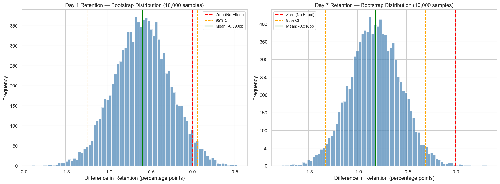
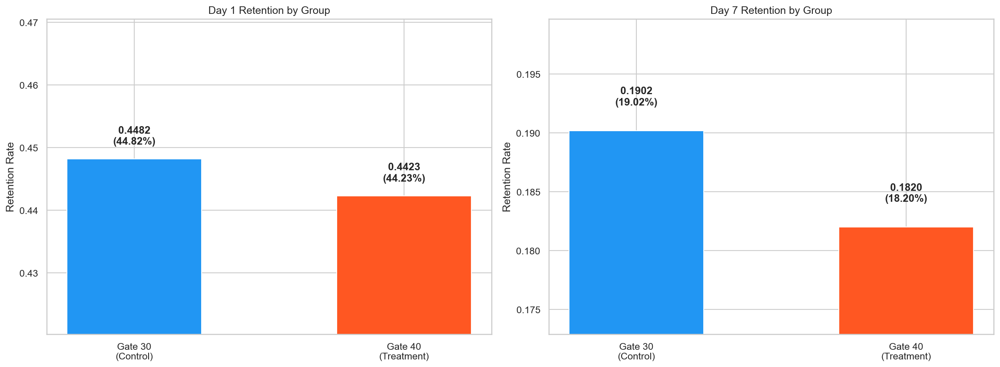
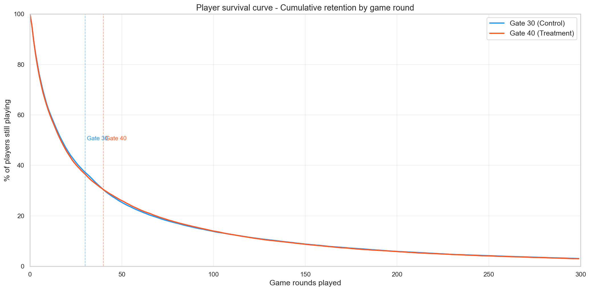

# GAME RETENTION and A/B TESTING
### --- A STATISTICAL DEEP DIVE ---

A rigorous A/B test analysis of player retention in a mobile game, **Cookie Cats**,  using multiple statistical methods that includes chi-squared tests, bootstrap confidence intervals, effect size calculations and power analysis. This project is curated to demonstrate the statistical thinking that game analytics teams rely on daily.



## PROJECT OVERVIEW

A/B testing is the cornerstone of data driven game design. This project analyzes a real A/B test from Cookie Cats (a popular mobile puzzle game by Tactile Entertainment) where the first progression gate was moved from level 30 to level 40.

**The Business Question:** Does moving the gate from level 30 to level 40 improve or hurt player retention?

**What makes this analysis stand out:** I decided that rather than running a single statistical test and calling it done, I would curate an analysis that applies multiple complementary methods such as frequentist tests, bootstrap simulation, effect size measurement and power analysis to build a complete, defensible conclusion.

## KEY FINDINGS

### Day 1 Retention: Directional Signal, Not Significant
- Control (Gate 30): **44.82%** vs Treatment (Gate 40): **44.23%**
- Difference: **-0.59 percentage points** (-1.32% relative)
- Chi squared p value: 0.076 (not significant at α = 0.05)
- Bootstrap 95% CI includes zero -> cannot rule out no effect

### Day 7 Retention: Statistically Significant Decline
- Control (Gate 30): **19.02%** vs Treatment (Gate 40): **18.20%**
- Difference: **-0.82 percentage points** (-4.31% relative)
- Chi squared p value: **0.0016** (significant)
- Bootstrap 95% CI entirely below zero -> robust negative effect

### Recommendation
**Keep the gate at level 30** - The earlier gate serves as a beneficial pacing mechanism that improves long term retention. At scale, the 0.82pp difference translates to ~820 fewer retained players per 100K installs.



## STATISTICAL METHODS APPLIED

| Method | Purpose | What It Shows |
|--------|---------|---------------|
| **Chi Squared Test** | Standard proportion comparison | Whether groups differ significantly |
| **Two Proportion Z-Test** | Proportion comparison with confidence intervals | Precision of the estimated difference |
| **Bootstrap Simulation** (10,000 samples) | Non parametric estimation | Distribution of the true effect without assumptions |
| **Cohen's h Effect Size** | Magnitude of the difference | Whether the effect is practically meaningful |
| **Statistical Power Analysis** | Test adequacy | Whether the sample was large enough to detect the effect |
| **Survival Curve Analysis** | Player drop off patterns | Where and when players stop playing |



## ANALYSIS SECTION

### 1. Data Exploration
- Dataset overview (90,189 players across two groups)
- Game rounds distribution comparison
- Overall retention rate baselines

### 2. Retention Rate Comparison
- Day 1 and Day 7 retention by group with confidence intervals
- Absolute and relative difference calculations

### 3. Frequentist Statistical Testing
- Chi squared test for independence
- Two proportion Z test with Wilson confidence intervals
- Multiple testing methods for robustness

### 4. Bootstrap Analysis
- 10,000 bootstrap resamples for non parametric estimation
- Visual distribution of the treatment effect
- Probability assessment (P(Treatment > Control))

### 5. Effect Size & Practical Significance
- Cohen's h for proportion effect sizes
- Number Needed to Treat (NNT) calculation
- Business impact quantification

### 6. Power Analysis
- Statistical power for observed effects
- Minimum detectable effect at 80% power
- Sample adequacy assessment

### 7. Engagement Analysis
- Retention by engagement tier (rounds played)
- Player survival curve with gate position markers
- Engagement stratified group comparisons

## TOOLS AND TECHNOLOGIES

- **Python 3.14** - core language
- **pandas / NumPy** - data manipulation
- **SciPy** - chi squared test, Z test
- **statsmodels** - proportion tests, confidence intervals, power analysis
- **Matplotlib / Seaborn** - visualizations
- **Jupyter Notebook** - analysis environment

## PROJECT STRUCTURE

```
game-retention-ab-testing/
|-- data/
|   |-- cookie_cats.csv                    # A/B test dataset (90190 players)
|-- notebooks/
|   |-- retention_ab_test_analysis.ipynb   # Full analysis notebook
|-- images/                                # Saved charts
|-- requirements.txt
|-- README.md
```

## GETTING STARTED

### Prerequisites
- Python 3.10+

### Installation
```bash
git clone https://github.com/rush2pranav/game-retention-ab-testing.git
cd game-retention-ab-testing

pip install -r requirements.txt
jupyter notebook notebooks/retention_ab_test_analysis.ipynb
```

### Dataset
Download from [Kaggle - Mobile Games A/B Testing](https://www.kaggle.com/datasets/yufengsui/mobile-games-ab-testing) and place `cookie_cats.csv` in the `data/` folder.

## WHAT I LEARNED

- **P values alone are insufficient** - A statistically significant result doesn't mean a practically important one. Combining p values with effect sizes (Cohen's h) and confidence intervals gives a much more complete picture. The Day 7 result was significant but the effect size was small and both facts matter for the business decision.
- **Bootstrap methods build intuition** - Seeing the physical distribution of 10,000 resampled differences is far more intuitive than a single p value. When the entire bootstrap distribution sits below zero, you can visually grasp that the effect is real.
- **Power analysis should come before the test, not after** - In practice, you'd run a power analysis during test design to determine the required sample size. Running it post-hoc (as I did here) still provides useful context about whether the test was capable of detecting small effects.
- **Business framing transforms analysis into action** - Translating "-0.82 percentage points" into "820 fewer retained players per 100K installs" makes the finding tangible for non technical stakeholders. This is something lot of beginners like me miss and need to home to become better at data analysis and something that I need to sharpen to become a data scientist.
- **Multiple methods build confidence** - When chi squared, Z test and bootstrap all agree, you can present findings with much more conviction than relying on a single test.

## POTENTION EXTENSIONS

- Add Bayesian A/B testing (Beta Binomial model) for probability of being best analysis
- Test additional gate positions (level 20, 25, 35) to find the optimal placement
- Segment the analysis by player geography or acquisition channel
- Build a reusable A/B testing framework in Python that can be applied to any two group proportion test
- Add sequential testing methodology for early stopping decisions
- Create an interactive Streamlit A/B test calculator

## LICENCE

This project is licenced under the MIT Licence - see the [LICENCE](LICENSE) file for details.

---

*I built this as part of my Game Data Analytics portfolio and to hone my Python skills. This project is a key to demonstrate the statistical rigor that is expected in game/data analytics roles ie from hypothesis formulation through multiple testing methods to business framed recommendations. I am open to any and every feedback in order to learn and grow, please feel free to open an issue or connect with me on [LinkedIn](https://linkedin.com/in/phulpagarpranav/).*